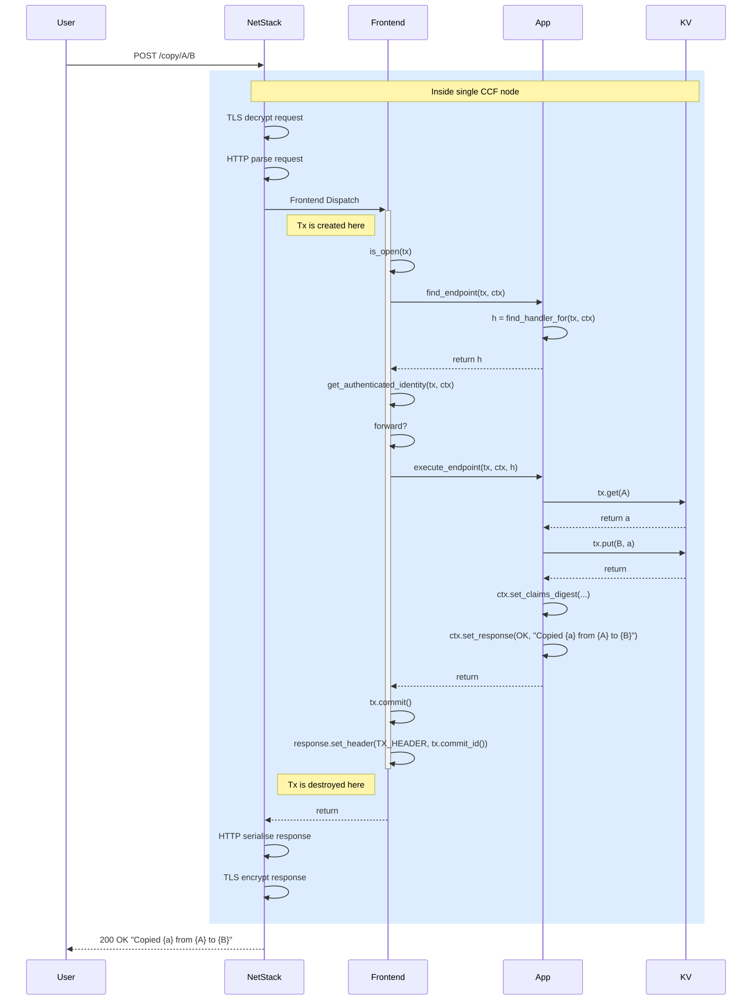
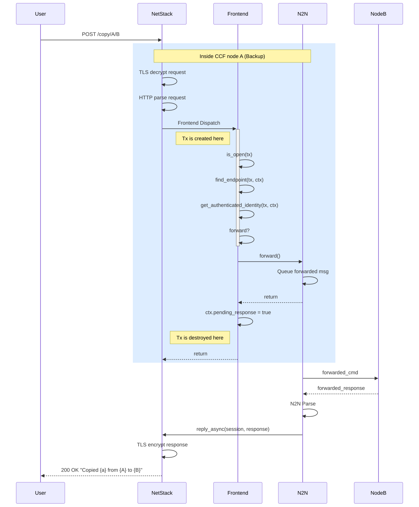
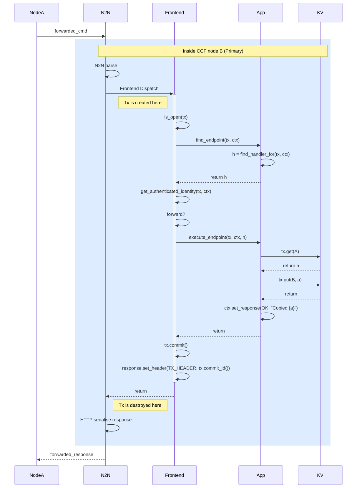
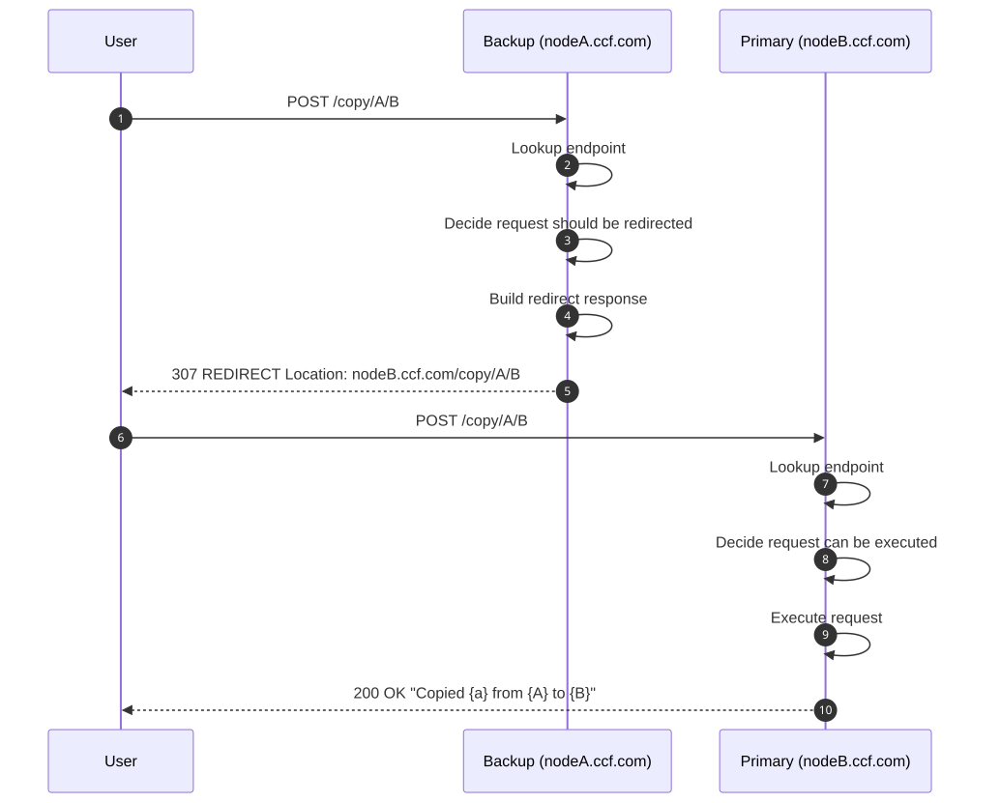
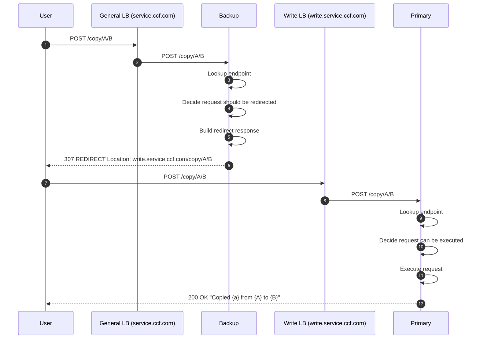

<!-- _class: lead -->

# CCF Deep Dive
## Request Flow & Application Model

How a client request becomes a transaction

---

# Agenda

1. **Request Lifecycle** — how a request flows through a CCF node
2. **Application Model** — building apps in C++ and JavaScript
3. **KV Store** — transactions, namespaces, and access control
4. **Recent Changes** — task system, block-on-commit in 7.x

---

# Section 1: Request Lifecycle

---

<!-- _class: tight -->

## Normal Flow (Primary Node)

<div class="columns"><div class="col">



</div><div class="col">

- **`kv::Tx`** created at frontend dispatch, destroyed after commit
- `is_open()` → `find_endpoint()` → `get_authenticated_identity()` → forward check → **execute**
- `tx.commit()` called automatically after handler returns
- Commit TX ID added as `x-ms-ccf-transaction-id` header
- **2xx → apply**, anything else → discard
  - Override with `set_apply_writes(true)`

</div></div>

---

<!-- _class: tight -->

## Forwarding (Backup → Primary)

<div class="columns3"><div class="col">



</div><div class="col">



</div><div class="col">

- Backup parses request, checks auth — does **not** execute handler
- Queues N2N message to primary, keeps TLS session open
- Primary executes handler, commits, responds over N2N

**Per-endpoint control** — `.set_forwarding_required()`:
- `Always` (default for writes) — always forward to primary
- `Sometimes` (default for reads) — forward if session was already forwarded
- `Never` — execute locally; write on backup = error

</div></div>

---

<!-- _class: tight -->

## Redirection — Direct to Node

<div class="columns"><div class="col">



</div><div class="col">

- **HTTP 307** with `Location` header → client resubmits directly
- Configured per-endpoint via `RedirectionStrategy`:
  - `ToPrimary` — redirect to primary
  - `ToBackup` — redirect to a backup for load balancing
  - `None` (default) — no redirection
- Requires nodes to have publicly accessible names

</div></div>

---

<!-- _class: tight -->

## Redirection — Via Load Balancer

<div class="columns"><div class="col">



</div><div class="col">

- For nodes not directly accessible: redirect via a **write load balancer** (e.g. `write.service.ccf.com`)
- **Warning:** Many HTTP clients strip `Authorization` headers on cross-origin redirects — intercept manually if using JWT

</div></div>

---

## Prefer Redirection over Forwarding

- **Forwarding** uses custom N2N plumbing, adds complex failure modes (primary failover mid-forward, session lifecycle), and is opaque to the client
- **Redirection** uses standard HTTP 307, is simpler to reason about, and lets clients retry naturally
- Where possible, prefer configuring endpoints with `RedirectionStrategy` over relying on forwarding
- Forwarding will be **deprecated** in a future release

---

## Threading Model

- Multiple **worker threads** for throughput, configured at node startup
- **Session consistency**: all commands from the same TLS connection execute on the same thread, in order
- Sessions straddling elections will be closed, to prevent inconsistencies. This is done broadly and conservatively, not by analysing actual inconsistencies
- Anything outside the KV is subject to ordinary C++ race conditions — think about data-structures and locking as appropriate

---

# Section 2: Application Model

---

## C++: Define Tables

The KV stores bytearray→bytearray under the hood.
C++ gives you typed wrappers:

```cpp
using RecordsMap = ccf::kv::Map<size_t, string>;

static constexpr auto PUBLIC_RECORDS  = "public:records";  // plaintext on ledger
static constexpr auto PRIVATE_RECORDS = "records";          // encrypted on ledger
```

Subclass `ccf::UserEndpointRegistry` to build your app:

```cpp
class LoggerHandlers : public ccf::UserEndpointRegistry { ... };
```

---

## C++: Write & Register a Handler

```cpp
auto record = [](auto& ctx, nlohmann::json&& params) {
  const auto in = params.get<LoggingRecord::In>();
  auto handle = ctx.tx.template rw<RecordsMap>("records");
  handle->put(in.id, in.msg);
  return ccf::make_success(true);
};

make_endpoint("/log/private", HTTP_POST,
              ccf::json_adapter(record), auth_policies)
  .install();
```

**Endpoint types:**
- `make_endpoint()` — read-write (requires primary)
- `make_read_only_endpoint()` — read-only (can run on any node)
- `make_command_endpoint()` — no KV access

---

## Layers of Read/Write Enforcement

Three separate levels — worth understanding the distinction:

| Layer | What it does | When |
|-------|-------------|------|
| **Endpoint declaration** | `make_read_only_endpoint` gives you a `ReadOnlyTx` — calling `put()` won't compile | Compile time |
| **Primary-only writes** | Write transactions can only commit on a primary. Write on a backup → error | Runtime |
| **Namespace restrictions** | KV enforces governance vs application table access per execution context | Runtime (esp. JS) |

---

## C++: Auth Policies

The 4th argument to `make_endpoint()` — tried in order, first to accept wins:

```cpp
const ccf::AuthnPolicies auth_policies = {
  ccf::jwt_auth_policy,
  ccf::user_cert_auth_policy,
  ccf::user_cose_sign1_auth_policy
};

make_endpoint("/log/private", HTTP_POST, handler, auth_policies)
  .install();
```

Custom policies can also be implemented (e.g. `CustomAuthPolicy` in the logging sample)

---

## C++: OpenAPI Schema (Optional)

Two approaches:

- **Auto-generation:** Use `DECLARE_JSON_TYPE` / `DECLARE_JSON_REQUIRED_FIELDS` macros, then chain `.set_auto_schema<RequestType, ResponseType>()` — CCF derives the OpenAPI schema from C++ types

- **Manual control:** Override `build_api(json& document, kv::ReadOnlyTx& tx)` on your registry to construct your own OpenAPI doc

---

## JavaScript Pattern

```javascript
export function get_private(request) {
  const parsedQuery = parse_request_query(request);
  const id = get_id_from_query(parsedQuery);
  const msg = ccf.kv["records"].get(id);
  if (msg === undefined) {
    return { statusCode: 404, body: { error: { code: "ResourceNotFound" } } };
  }
  return { body: { msg: ccf.bufToStr(msg) } };
}
```

---

## JS vs C++ Key Differences

- **Raw byte KV access:** KV is bytearray→bytearray. C++ typed wrappers serialize transparently. In JS you work with `ArrayBuffer` directly, calling `ccf.strToBuf()` / `ccf.bufToStr()` yourself. TypeScript wrappers from `@microsoft/ccf-app` can add type enforcement.

- **Endpoint registration** via `app.json` manifest (not code)

- **Return values** are `{ statusCode, body }` objects

---

# Section 3: KV Store

---

## Core Concepts

| Concept | Detail |
|---------|--------|
| **Map** | Named key-value collection. Created implicitly on first write |
| **Public vs Private** | `"public:foo"` → plaintext on ledger. `"foo"` → encrypted |
| **Transaction (`kv::Tx`)** | Atomic unit per endpoint. Auto-retried on conflict |
| **MapHandle** | `tx.rw<T>("name")` → `get()`, `put()`, `remove()`, `has()`, `foreach()` |
| **Read/Write handles** | `tx.ro()` and `tx.wo()` for compile-time safety |
| **Global commit** | Majority of nodes acknowledged → `get_globally_committed()` |

---

## Commit Semantics

- **2xx** response → transaction applied to KV and replicated
- **Non-2xx** → transaction discarded
  - Override: `set_apply_writes(true)` (e.g. to log failed requests)
- TX ID returned via `x-ms-ccf-transaction-id` header
- A transaction is **globally committed** once a majority of nodes have acknowledged it

---

## Table Namespaces

| Namespace | Prefix | Purpose |
|-----------|--------|---------|
| **Governance** | `public:ccf.gov.*` | Member-controlled, constitution-gated |
| **Internal** | `ccf.internal.*` | Framework-only (signatures, consensus) |
| **Application** | Anything else | Your app's data |

---

## Permission Matrix

| Context | Governance (public) | Application |
|---------|-----------|-------------|
| Pre-approval governance (ballots, validate) | Read-only | None |
| Post-approval governance (apply) | Read/Write | **Write-only** |
| Application endpoints | **Read-only** | Read/Write |

**Key insight:** App code **CAN read** governance tables (for auth, metadata),
but **CANNOT write** them → all governance changes traceable to member signatures

---

## Notable Built-in Tables

`public:ccf.gov.*`:

| Table | Content |
|-------|---------|
| `members.certs` / `members.info` | Consortium membership and status |
| `users.certs` / `users.info` | Registered users |
| `nodes.info` | Node identity, status, attestations |
| `service.info` | Service identity (Opening → Open → Recovering) |
| `proposals` / `proposals_info` | Governance proposals and voting state |

---

# Section 4: Recent Changes

---

## What's New in 7.x

- **Task system** — a new async execution model aiming for better hardware utilisation in a post-SGX world
  - Available now in 7.x, expected to replace a lot of internal work soon
- **Block-on-commit responses** — commit notification takes a fundamentally different call-stack, built on top of the task system
  - Allows the thread to do other work while waiting for consensus, instead of blocking

---

## Further Reading

- **[Node-to-Node Channels](https://ccf.dev/main/architecture/node_to_node.html)**
  Authenticated DH key exchange, AES-GCM channels, replay protection
- **[Threading](https://ccf.dev/main/architecture/threading.html)**
  Worker threads, session consistency guarantees
- **[User Authentication](https://ccf.dev/main/build_apps/auth/index.html)**
  JWT, cert, and COSE authentication details
- **[Built-in Maps](https://ccf.dev/main/audit/builtin_maps.html)**
  Full reference for all `public:ccf.gov.*` tables

---

# Questions?
